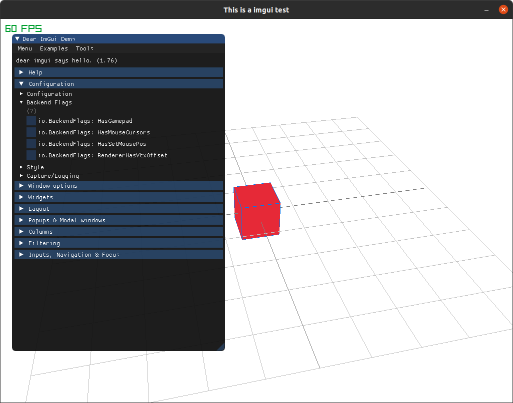

# cimgui-raylib

The cimgui-raylib runtime provides functionality to integrate [Dear ImGui](https://github.com/ocornut/imgui) using [Raylib](https://www.raylib.com/). cimgui-raylib is based on (cimgui)[https://github.com/cimgui/cimgui].

Integrate raylib with imgui can be tricky, since raylib is made in C and Dear Imgui is made in C++, you have two options: or you use the C++ bindings for Raylib, or you use the C bindings for Dear Imgui. This repo uses the second aproach, creating an imgui implementation file for rlgl, raylib's openGL abstraction layer. Since this aproach proved to be much slower than the native openGL implementations from imgui, I prioritized portability and ease of use.

One of the most amazing features of [Raylib](https://www.raylib.com/), besides the ease of use and its numerous ports to several languages, is the ability to compile to [WebAssembly](https://webassembly.org/), allowing to show your games arround the world with just a link.

## Known Bugs
I think it's fair to let you know the problems early. So, here we go:

* Mouse cursor is not shown in web fullscreen. 
I'm working on this.

## Licensing
Take this code and do whatever you want, I'm not responsable for any damage or problem this software have or create. This is not intended to be a comercial product.

## Examples

This Make-based project is an example of how to use the library on a 2D setting.

### Example
[Example](https://weremsoft.github.io/c99-raylib-cimgui-template/)

## Notes

You have to compile your own libraries for mac/windows/linux for raylib and dearimgui. The process is fairly simple and properly covered by their creators(specially Raylib), but if you feel lost you can create a issue and I'll take a look and help when possible.

This project is based on Make as a build pipeline.
